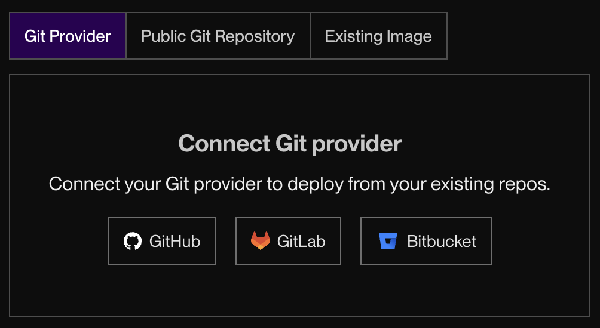
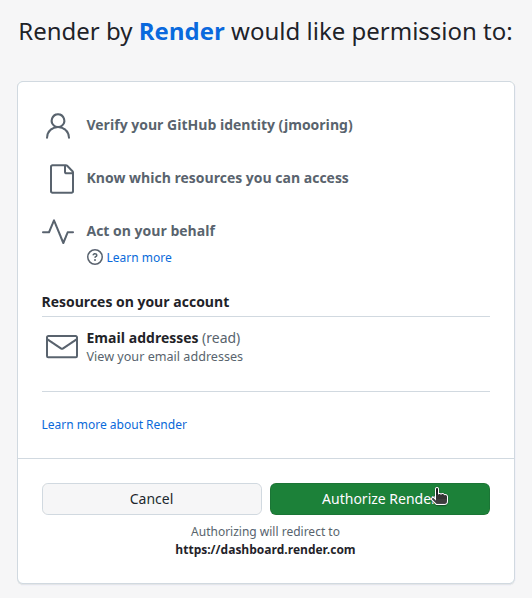
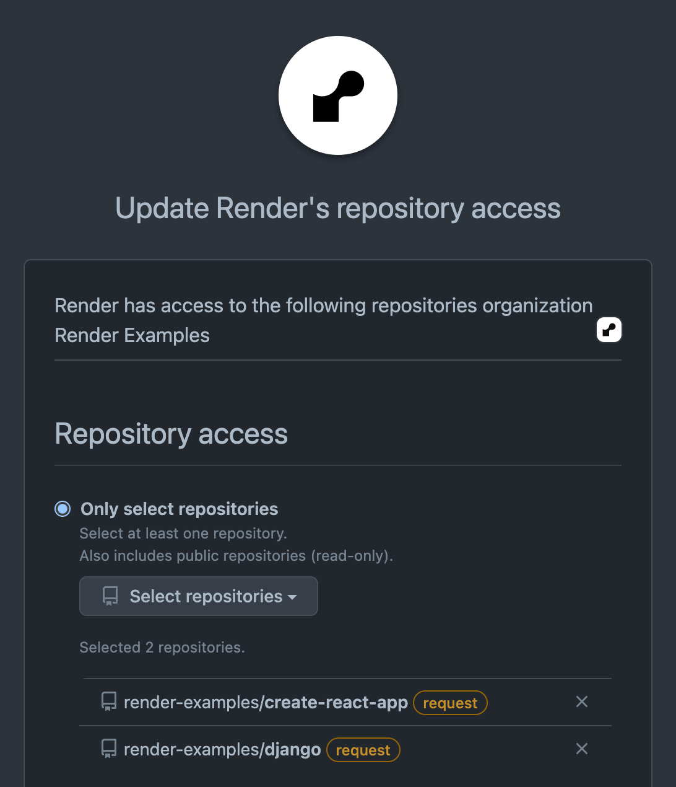
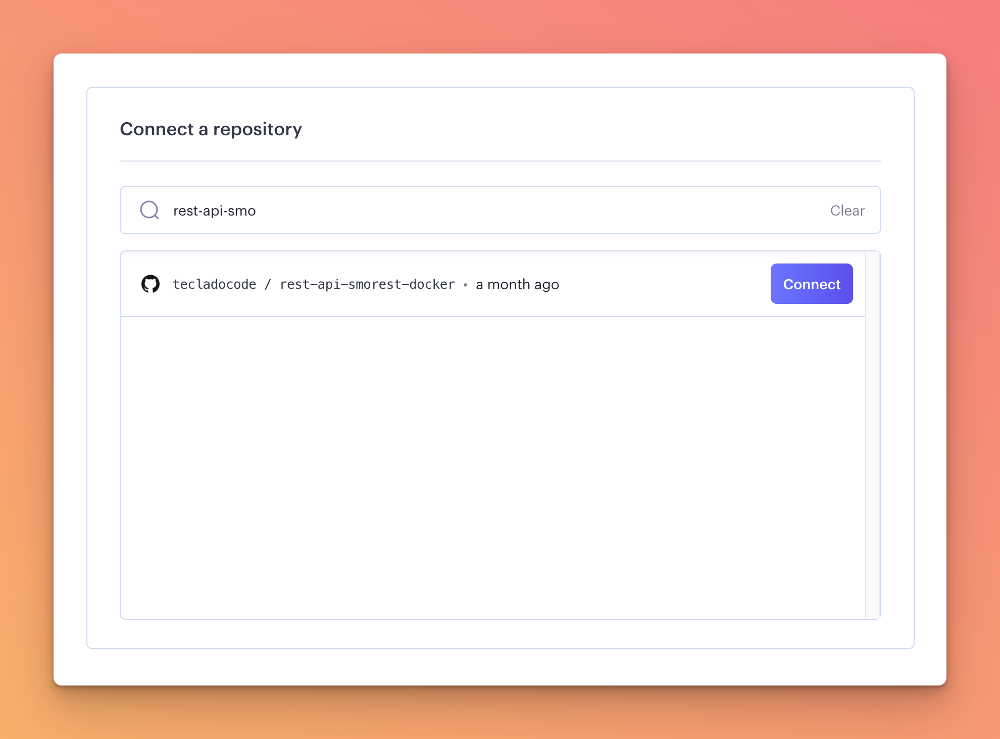
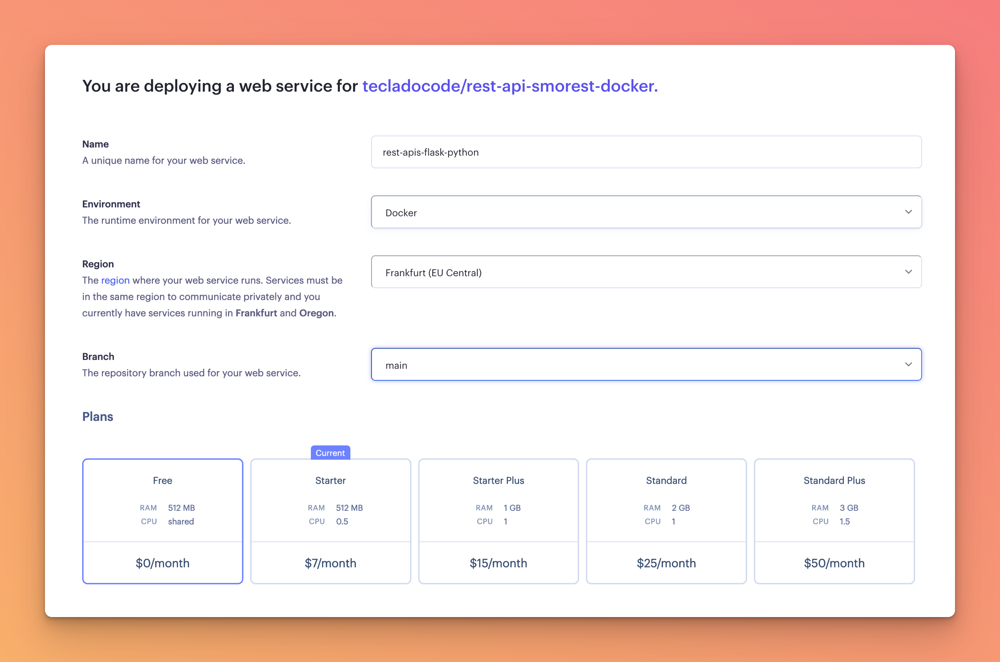

# RenderとGitHubの連携（Connect a repository）の詳しい手順

Renderの画面で「Connect a repository」の部分がわかりにくいとのこと、承知いたしました。
このステップは、**「Render（サーバー）に、あなたがGitHubに保存したファイルを読み取る許可を与える」**ための作業です。

実際の画面のスクリーンショットを交えながら、一つずつ丁寧に解説します。

---

## 1. Web Serviceの作成を開始する

Renderのダッシュボード（ログイン後の画面）の右上にある **「+ New」** ボタンをクリックし、メニューから **「Web Service」** を選択します。

> **※注意**
> もし「Build and deploy from a Git repository」という画面が出た場合は、そのまま「Next」を押して進んでください。

---

## 2. GitHubと連携する（Connect Git provider）

次に、ソースコードをどこから持ってくるかを選ぶ画面になります。

1. 画面の右側にある **「GitHub」** というボタンをクリックします。
   （※まだGitHubと連携していない場合、このボタンが表示されます）

---

## 3. GitHub側でRenderを許可する

GitHubの画面に自動的に切り替わり、「Render by Render would like permission to:（Renderが許可を求めています）」という画面が表示されます。

1. 画面の一番下にある緑色の **「Authorize Render」**（Renderを許可する）ボタンをクリックします。
2. （※ここでGitHubのパスワードを求められた場合は入力してください）

---

## 4. リポジトリへのアクセス権を設定する

続いて「Update Render's repository access（Renderのリポジトリアクセスを更新）」という画面になります。
ここでは、Renderにどのファイルを読ませるかを選びます。

1. **「Only select repositories」**（選択したリポジトリのみ）を選びます。
2. その下にある **「Select repositories」** のドロップダウンメニューをクリックします。
3. あなたが先ほど作成したリポジトリ（例：`あなたの名前/mf-line-bot`）を探してチェックを入れます。
4. 画面の一番下にある緑色の **「Install」** または **「Save」** ボタンをクリックします。

---

## 5. リポジトリを「Connect」する

Renderの画面に戻ってきます。
「Connect a repository」という画面になり、先ほど許可したあなたのリポジトリ（`mf-line-bot`）が一覧に表示されているはずです。

1. リポジトリの右側にある青い **「Connect」** ボタンをクリックします。

---

## 6. サーバーの設定を入力する

リポジトリが接続されると、サーバーの設定画面（Name, Region, Branch などを入力する画面）に進みます。

ここからは、元の手順書「Step 2-3. サーバーの設定を入力する」に戻って設定を続けてください。

- **Name**: `mf-line-bot`（好きな名前でOK）
- **Region**: `Singapore` または `Oregon`
- **Branch**: `main`
- **Runtime**: `Docker`
- **Instance Type**: `Free`（無料プラン）

---

もし、上記の手順の中で「この画面が出ない」「違う画面になった」などがあれば、どのステップで止まっているか教えていただければサポートいたします！
